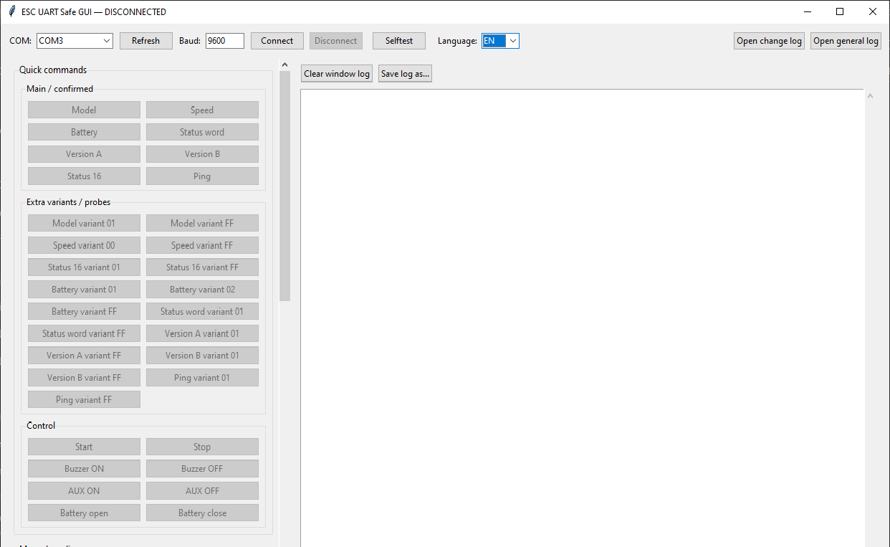

# Blinkee.city kickscooter
# ESC UART GUI — scanner and command tool



Example view of the main program window with the command panel, COM port configuration and TX/RX log.

---

## English

### About

ESC UART GUI is a Python/Tkinter tool for testing, logging and reverse engineering UART communication between an IoT/dashboard module and an ESC controller.

The program sends commands in the following format:

```text
CMD_HI CMD_LO LEN VALUE... CRC32/MPEG-2
```

It can calculate CRC automatically, send known commands, log TX/RX traffic, decode selected responses and carefully scan command ranges.

This project was created from real hardware tests, UART logs and reverse engineering work.

---

### Main features

- Python/Tkinter GUI.
- COM port support through `pyserial`.
- Automatic CRC32/MPEG-2 calculation.
- Manual HEX payload sending.
- Ready-to-use buttons for confirmed commands.
- START-based heartbeat.
- TX/RX logging to text files.
- 4-byte command range autoscan.
- Smart Tree Scan for finding active command families.
- Step-by-step autotest mode.
- Scrollable left panel for smaller screens.
- Response decoder for battery, speed, model, firmware versions, status and ping.
- OTA/flash-related families `0F 02` and `0F 03` are blocked to avoid accidental memory/flash operations.

---

### Warning

This tool is intended for laboratory work and reverse engineering of hardware you own or have permission to test.

Some commands may change the ESC state, battery lock state, buzzer, AUX output or other controller functions. OTA/flash-related commands may be dangerous and can potentially corrupt device memory.

In this version, the following command families are intentionally blocked:

```text
0F 02
0F 03
```

Do not probe OTA/flash families on a live controller unless you fully understand the protocol and the risks.

Use this tool responsibly.

---

### Requirements

- Python 3.10+
- Windows or Linux
- USB-UART adapter
- `pyserial`

Install dependencies:

```bash
pip install pyserial
```

---

### Run

```bash
python esc_uart_gui_tkinter.py
```

Basic usage:

1. Select the COM port.
2. Set baudrate, default is `9600`.
3. Click `Connect`.
4. Use the command buttons or manual HEX field.
5. TX/RX logs are shown in the right panel and saved to text files.

---

### TX frame format

The tool uses this frame format:

```text
CMD_HI CMD_LO LEN VALUE... CRC32_MPEG2
```

Even an empty read command should be sent with `LEN=01` and value `00`:

```text
XX XX 01 00 + CRC
```

3-byte payloads such as:

```text
XX XX 00 + CRC
```

are not used, because they did not work correctly in testing.

---

### CRC32/MPEG-2

CRC parameters:

```text
poly   = 0x04C11DB7
init   = 0xFFFFFFFF
refin  = false
refout = false
xorout = 0x00000000
```

Example:

```text
START payload: 00 02 01 01
TX frame:      00 02 01 01 12 6D 58 1E
```

---

### Confirmed commands

#### Start / Stop

```text
START: 00 02 01 01 + CRC
STOP:  00 02 01 00 + CRC
```

Typical responses:

```text
80 02 01 01 + CRC
80 02 01 00 + CRC
```

#### Battery

```text
BATTERY: 01 02 01 00 + CRC
```

Typical response:

```text
81 02 01 XX + CRC
```

`XX` is the battery percentage.

Examples:

```text
64 = 100%
20 = 32%
00 = 0%
```

#### Speed

```text
SPEED: 00 04 01 01 + CRC
```

Typical response:

```text
80 04 02 XX YY ...
```

Speed value:

```text
uint16_be(XX YY) / 10.0
```

Examples:

```text
00 22 = 34  -> 3.4 km/h
00 21 = 33  -> 3.3 km/h
00 0B = 11  -> 1.1 km/h
00 38 = 56  -> 5.6 km/h
00 EB = 235 -> 23.5 km/h
```

#### Model

```text
MODEL: 00 01 01 00 + CRC
```

Example response from logs:

```text
80 01 07 58 4C 54 38 35 35 53 ...
```

ASCII:

```text
XLT855S
```

#### Version A / Version B

```text
VERSION A: 02 02 01 00 + CRC
VERSION B: 02 03 01 00 + CRC
```

Examples from logs:

```text
VERSION A: T_1_3_4
VERSION B: T_1_2_1
```

#### Status 16

```text
STATUS 16: 00 08 01 00 + CRC
```

Typical response:

```text
80 08 02 XX YY ...
```

The decoder displays it as `STAT16=0xXXXX`.

#### Ping

```text
PING: 0E 00 01 00 + CRC
```

Typical response:

```text
8E 00 01 01 + CRC
```

#### Buzzer / AUX / Battery lock

```text
BUZZER OFF:    03 03 01 00 + CRC
BUZZER ON:     03 03 01 01 + CRC
AUX OFF:       03 04 01 00 + CRC
AUX ON:        03 04 01 01 + CRC
BATTERY OPEN:  03 05 01 00 + CRC
BATTERY CLOSE: 03 05 01 01 + CRC
```

Use control commands carefully.

---

### Files created by the program

```text
esc_uart_gui_log.txt                 general TX/RX log
esc_uart_gui_response_changes.txt    interesting/different response log
esc_uart_scan_progress.json          regular autoscan progress
smart_scan_progress.json             smart scan progress
smart_family_logs/                   smart scan family logs
esc_uart_gui_window.json             saved window geometry
```

---

### Safe testing rules

- Test with the wheel lifted or with no load first.
- Do not click control commands unless you know what they do.
- Do not send OTA/flash command families.
- Do not assume that an echoed response means the function is safe.
- Start scanning with small ranges.
- Save logs from every session.
- Do not run large scans on an active vehicle.

---

### Repository structure

Minimal repository layout:

```text
.
├── README.md
├── esc_uart_gui_tkinter.py
└── program_screenshot.png
```

---

### Voluntary support

If this project helped you, saved you time or helped you move forward with hardware analysis, you can voluntarily support the work here:

[Support the project on BuyCoffee.to](https://buycoffee.to/arasusx-cyber)

Support is not required. The project remains open. A GitHub star, testing, bug report, suggestion or sharing the repository also helps.

---

### Project status

This is a work-in-progress reverse engineering tool. The protocol has been partially identified from TX/RX logs.

Confirmed parts include:

- start/stop,
- battery percentage,
- speed as `/10` value,
- model,
- firmware versions,
- ping,
- basic status responses.

Unknown or potentially dangerous command families should be treated as experimental.

---

## Polski

### O projekcie

ESC UART GUI to narzędzie w Pythonie/Tkinter do testowania, logowania i reverse engineeringu komunikacji UART między modułem IoT/licznikiem a kontrolerem ESC.

Program wysyła komendy w formacie:

```text
CMD_HI CMD_LO LEN VALUE... CRC32/MPEG-2
```

Potrafi automatycznie liczyć CRC, wysyłać znane komendy, logować ruch TX/RX, dekodować wybrane odpowiedzi i ostrożnie skanować zakresy komend.

Projekt powstał na podstawie realnych testów sprzętu, logów UART i pracy reverse engineeringowej.

---

### Najważniejsze cechy

- GUI w Pythonie/Tkinter.
- Obsługa portów COM przez `pyserial`.
- Automatyczne liczenie CRC32/MPEG-2.
- Ręczne wysyłanie payloadów HEX.
- Gotowe przyciski dla potwierdzonych komend.
- Heartbeat oparty o komendę START.
- Logowanie TX/RX do plików.
- Autoscan zakresu 4-bajtowych komend.
- Smart Tree Scan do szukania aktywnych rodzin komend.
- Autotest krokowy na wybranym zakresie.
- Scrollowany lewy panel dla mniejszych ekranów.
- Dekoder odpowiedzi dla baterii, prędkości, modelu, wersji firmware, statusu i pingu.
- Rodziny OTA/flash `0F 02` oraz `0F 03` są zablokowane, żeby nie wykonać przypadkiem operacji na pamięci/flash.

---

### Ostrzeżenie

To narzędzie jest przeznaczone do pracy laboratoryjnej oraz reverse engineeringu sprzętu, który należy do Ciebie albo masz zgodę, żeby go testować.

Niektóre komendy mogą zmieniać stan ESC, blokady baterii, buzzera, wyjścia AUX albo innych funkcji kontrolera. Komendy związane z OTA/flash mogą być niebezpieczne i potencjalnie uszkodzić zawartość pamięci urządzenia.

W tej wersji programu celowo zablokowane są rodziny:

```text
0F 02
0F 03
```

Nie należy sondować rodzin OTA/flash na żywym sterowniku bez pełnego zrozumienia protokołu i ryzyka.

Używaj narzędzia odpowiedzialnie.

---

### Wymagania

- Python 3.10+
- Windows albo Linux
- Adapter USB-UART
- `pyserial`

Instalacja zależności:

```bash
pip install pyserial
```

---

### Uruchomienie

```bash
python esc_uart_gui_tkinter.py
```

Podstawowe użycie:

1. Wybierz port COM.
2. Ustaw baudrate, domyślnie `9600`.
3. Kliknij `Connect`.
4. Używaj gotowych przycisków albo pola ręcznego HEX.
5. Logi TX/RX pojawią się w prawym panelu i zapiszą do plików tekstowych.

---

### Format ramek TX

Program używa formatu:

```text
CMD_HI CMD_LO LEN VALUE... CRC32_MPEG2
```

Nawet pusty odczyt powinien być wysyłany z `LEN=01` i wartością `00`:

```text
XX XX 01 00 + CRC
```

Nie są używane 3-bajtowe payloady typu:

```text
XX XX 00 + CRC
```

bo w testach nie działały poprawnie.

---

### CRC32/MPEG-2

Parametry CRC:

```text
poly   = 0x04C11DB7
init   = 0xFFFFFFFF
refin  = false
refout = false
xorout = 0x00000000
```

Przykład:

```text
START payload: 00 02 01 01
TX frame:      00 02 01 01 12 6D 58 1E
```

---

### Potwierdzone komendy

#### Start / Stop

```text
START: 00 02 01 01 + CRC
STOP:  00 02 01 00 + CRC
```

Typowe odpowiedzi:

```text
80 02 01 01 + CRC
80 02 01 00 + CRC
```

#### Bateria

```text
BATTERY: 01 02 01 00 + CRC
```

Typowa odpowiedź:

```text
81 02 01 XX + CRC
```

`XX` to procent baterii.

Przykłady:

```text
64 = 100%
20 = 32%
00 = 0%
```

#### Prędkość

```text
SPEED: 00 04 01 01 + CRC
```

Typowa odpowiedź:

```text
80 04 02 XX YY ...
```

Wartość prędkości:

```text
uint16_be(XX YY) / 10.0
```

Przykłady:

```text
00 22 = 34  -> 3.4 km/h
00 21 = 33  -> 3.3 km/h
00 0B = 11  -> 1.1 km/h
00 38 = 56  -> 5.6 km/h
00 EB = 235 -> 23.5 km/h
```

#### Model

```text
MODEL: 00 01 01 00 + CRC
```

Przykładowa odpowiedź z logów:

```text
80 01 07 58 4C 54 38 35 35 53 ...
```

ASCII:

```text
XLT855S
```

#### Version A / Version B

```text
VERSION A: 02 02 01 00 + CRC
VERSION B: 02 03 01 00 + CRC
```

Przykłady z logów:

```text
VERSION A: T_1_3_4
VERSION B: T_1_2_1
```

#### Status 16

```text
STATUS 16: 00 08 01 00 + CRC
```

Typowa odpowiedź:

```text
80 08 02 XX YY ...
```

Dekoder pokazuje wartość jako `STAT16=0xXXXX`.

#### Ping

```text
PING: 0E 00 01 00 + CRC
```

Typowa odpowiedź:

```text
8E 00 01 01 + CRC
```

#### Buzzer / AUX / blokada baterii

```text
BUZZER OFF:    03 03 01 00 + CRC
BUZZER ON:     03 03 01 01 + CRC
AUX OFF:       03 04 01 00 + CRC
AUX ON:        03 04 01 01 + CRC
BATTERY OPEN:  03 05 01 00 + CRC
BATTERY CLOSE: 03 05 01 01 + CRC
```

Komend sterujących używaj ostrożnie.

---

### Pliki tworzone przez program

```text
esc_uart_gui_log.txt                 ogólny log TX/RX
esc_uart_gui_response_changes.txt    log ciekawych/różniących się odpowiedzi
esc_uart_scan_progress.json          postęp zwykłego autoskanu
smart_scan_progress.json             postęp smart skanu
smart_family_logs/                   logi rodzin smart skanu
esc_uart_gui_window.json             zapis geometrii okna
```

---

### Bezpieczne zasady testowania

- Najpierw testuj na podniesionym kole albo bez obciążenia.
- Nie klikaj komend sterujących bez wiedzy, co robią.
- Nie wysyłaj rodzin OTA/flash.
- Nie zakładaj, że echo odpowiedzi oznacza bezpieczną funkcję.
- Przy skanowaniu zaczynaj od małych zakresów.
- Zapisuj logi z każdej sesji.
- Nie używaj dużych zakresów skanowania na aktywnym pojeździe.

---

### Struktura repozytorium

Minimalny układ repozytorium:

```text
.
├── README.md
├── esc_uart_gui_tkinter.py
└── program_screenshot.png
```

---

### Dobrowolne wsparcie

Jeśli projekt Ci się przydał, oszczędził czas albo pomógł ruszyć z miejsca przy analizie sprzętu, możesz dobrowolnie postawić mi kawę:

[Wesprzyj projekt na BuyCoffee.to](https://buycoffee.to/arasusx-cyber)

Wsparcie nie jest wymagane. Projekt zostaje otwarty — każda gwiazdka na GitHubie, test, zgłoszenie błędu, sugestia albo udostępnienie repozytorium też pomaga.

---

### Status projektu

Projekt jest roboczym narzędziem reverse engineeringowym. Protokół został rozpoznany częściowo na podstawie logów TX/RX.

Potwierdzone są między innymi:

- start/stop,
- bateria,
- prędkość jako wartość `/10`,
- model,
- wersje firmware,
- ping,
- podstawowe odpowiedzi statusowe.

Nieznane lub potencjalnie niebezpieczne rodziny komend powinny być traktowane jako eksperymentalne.
